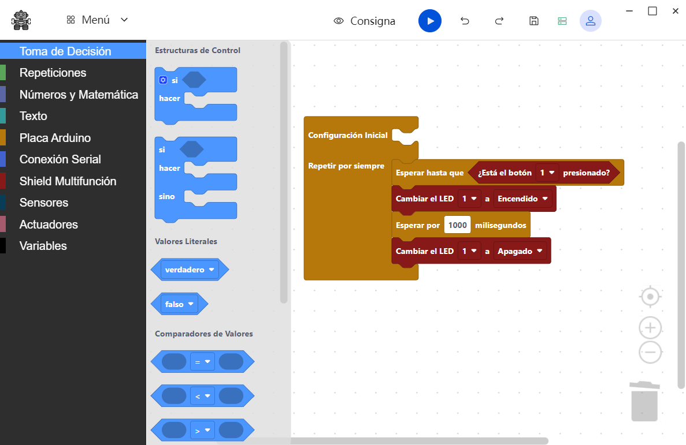

# ArguiBot IDE
ArguiBot IDE es un entorno de desarrollo de código abierto diseñado para la enseñanza de la robótica a estudiantes de nivel secundario. Se basa en programación en bloque y está enfocado en proporcionar una forma sencilla de introducir conceptos de robótica y programación usando la plataforma Arduino. 

ArguiBot está diseñado utilizando un conjunto reducido de bloques que simplifican la creación de algoritmos. No requiere de kits de robótica específicos, lo que reduce costos económicos para su implementación en diferentes entornos educativos. Además, ArguiBot busca mejorar la experiencia de enseñanza y aprendizaje proporcionando un conjunto de funcionalidades para el seguimiento del progreso de los estudiantes y la entrega de trabajos.



## Instalación
Seguir los siguientes pasos para lograr una instalación de ArguiBot:

1. Descargar el instalador de la última versión de ArguiBot disponible [aqui](https://github.com/nicostreri/ArguiBot/releases).
2. Ejecutar el instalador y seguir los pasos.
3. Instalar el core de Arduino AVR. Para ello ejecutar:

```bash
    # Ir a la carpeta de instalación
    cd C:\Users\....\ArguiBot IDE\

    # Instalar Arduino AVR
    .\arduino-cli.exe core install arduino:avr
```
4. Ejecutar la herramienta. Utilizar el código de grupo: "*grupodemo*"

**Nota:** Actualmente, el servidor de sincronización de ArguiBot está en desarrollo, la herramienta solamente se conecta a un servidor de prueba.

## Compilación y Conexión al Servidor
TODO

## Trabajo Pendiente
Actualmente, ArguiBot se encuentra en su primera versión que permite trabajar con una cantidad limitada de sensores y actuadores. 

A continuación se presenta la lista de funcionalidades próximas a implementar: 

[_] Servidor Backend que permita el manejo de las actualizaciones del programa y bibliotecas Arduino, utilizando PHP (por su bajo costo de alojamiento) y la posibilidad de ejecución del servidor en LAN (sin depender de conexión a Internet).

[_] Servidor Backend que permita el manejo de grupos, proyectos de trabajo y Secuencia de Actividades. Además, la entrega de comentarios del docente a los trabajos enviados por los estudiantes.

[_] Manual de ayuda para los bloques disponibles.

[_] Incorporación de más sensores y actuadores, sin descuidar la idea de ofrecer un entorno simple para la enseñanza de los conceptos fundamentales del pensamiento computacional. 

[_] Documentar el API de actualización del programa y de las bibliotecas Arduino utilizadas.

[_] API para incorporar bloques de forma remota.

[_] Automatizar el proceso de instalación del core Arduino AVR.


## Desarrollo, Tecnologías y Compilación 
ArguiBot IDE está diseñado utilizando las siguientes herramientas:

- [Blockly](https://github.com/google/blockly)
- [Tauri](https://tauri.app/)
- Node, Vue.JS, Pinia.

## Licencia
The MIT License (MIT). Please see [License File](./LICENSE) for more information.

Third party credits: [see more here](./docs/thirdPartyLicenses.txt)